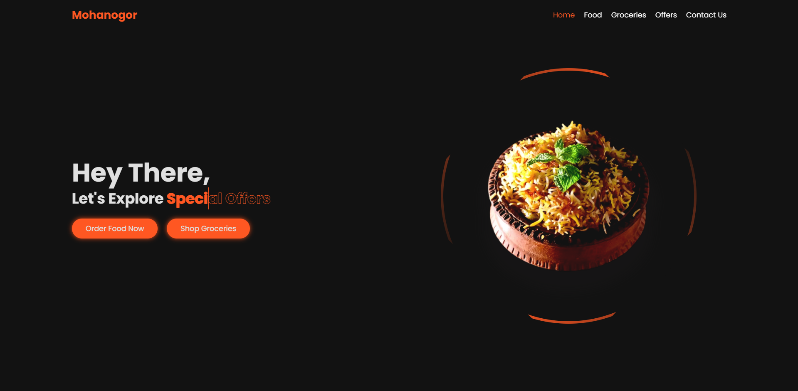

# Mohanogor Website

**Mohanogor** is a responsive and visually appealing website designed for showcasing food, groceries, and offers. It is built using HTML abd CSS, ensuring smooth navigation and a great user experience across all devices.

---

## Features

- **Responsive Navbar**: A clean and fully responsive navigation bar with a hamburger menu for mobile devices.
- **Modern Layout**: Flexbox-based design for alignment and responsiveness.
- **Interactive Animations**: Subtle animations for visual appeal.
- **Call-to-Actions**: Buttons to encourage user interaction, such as ordering food or shopping for groceries.
- **Rotating Image Border**: A visually appealing rotating gradient effect around the featured image.

---

## Technologies Used

- **HTML5**: For semantic structure.
- **CSS3**: For styling and responsive design.

---

## Setup Instructions

1. Clone or download the repository.
2. Place the files in your local project directory.
3. Open `index.html` in your browser to view the website.

---

## File Structure

- **index.html**: The main HTML structure of the website.
- **styles.css**: The CSS file for styling and responsive design.
- **assets**: Directory for images (e.g., `biriyani.png`).

---

## Screenshots

### Desktop View

---

## Contact

For inquiries or collaborations, feel free to reach out:

- **Author**: Naimul Islam Mehedi
- **Email**: mehedi.interface@gmail.com
- **GitHub**: https://github.com/MehediAndInterface
- **LinkedIn**: https://www.linkedin.com/in/interfacebymehedi/

---

## License

This project is licensed under the MIT License. You are free to use, modify, and distribute it as per the license terms.

---

## Acknowledgements

- Special thanks to the **Mohanogor** team for the inspiration.
- Icons by [Boxicons](https://boxicons.com/).

---

> **Credits**: Developed by **Naimul Islam Mehedi**. If you like this project or want to collaborate, feel free to contact me!
